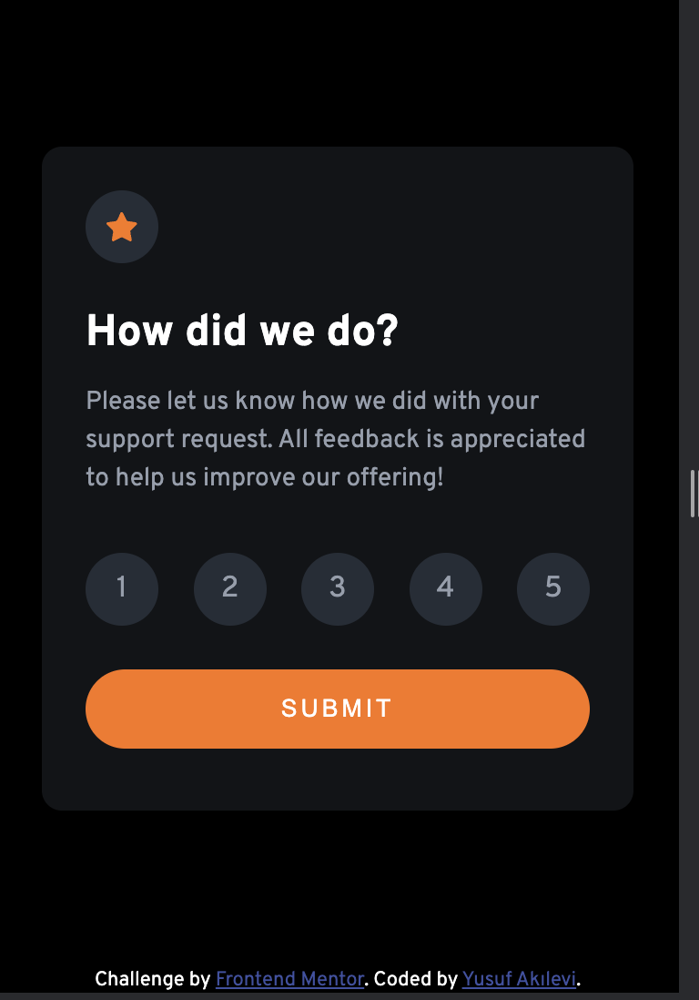
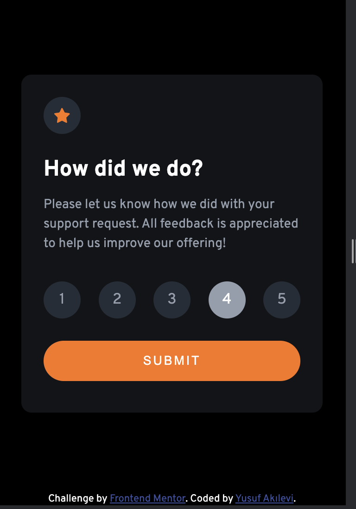

# Frontend Mentor - Interactive rating component solution

This is a solution to the [Interactive rating component challenge on Frontend Mentor](https://www.frontendmentor.io/challenges/interactive-rating-component-koxpeBUmI). Frontend Mentor challenges help you improve your coding skills by building realistic projects.

## Table of contents

- [Overview](#overview)
  - [The challenge](#the-challenge)
  - [Screenshot](#screenshot)
  - [Links](#links)
- [My process](#my-process)
  - [Built with](#built-with)
  - [What I learned](#what-i-learned)
  - [Useful resources](#useful-resources)
- [Author](#author)
- [Acknowledgments](#acknowledgments)

**Note: Delete this note and update the table of contents based on what sections you keep.**

## Overview

### The challenge

Users should be able to:

- View the optimal layout for the app depending on their device's screen size
- See hover states for all interactive elements on the page
- Select and submit a number rating
- See the "Thank you" card state after submitting a rating

### Screenshot






### Links

- Solution URL: [(https://github.com/YusufAkilevi/Interactive-Rating-Component-Frontend-Mentor)](https://github.com/YusufAkilevi/Interactive-Rating-Component-Frontend-Mentor)
- Live Site URL: [Add live site URL here](https://your-live-site-url.com)

## My process

### Built with

- Semantic HTML5 markup
- CSS custom properties
- Flexbox
- CSS Grid
- Media Queries for Responsive Design
- Desktop-first workflow
- JavaScript

### What I learned

First, I designed the structure the HTML of my project. After that, I started to work on style of the components. In this stage, I used Flexbox for layout of the pade and absolute positioning to place the thank you stage. I learned new properties in CSS to create animation when a component disappears and appears. When I used

```css
.close {
  display: none;
}
```

to make a component unvisible I can not be able to create an animation effect for the component. However, when I used these properties to make a component disappear I can create an animation effect.

```css
.close {
  opacity: 0;
  pointer-events: none;
  visibility: none;
}
```

### Useful resources

- [Example resource 1](https://developer.mozilla.org/en-US/) - You can find anything related Javascript, CSS or HTML in this website.

## Author

- Frontend Mentor - [@YusufAkilevi](https://www.frontendmentor.io/profile/YusufAkilevi)
- GitHub - [@YusufAkilevi](https://github.com/YusufAkilevi)

## Acknowledgments

I worked alone in this project. But I hope to work on an open source project in the future.
